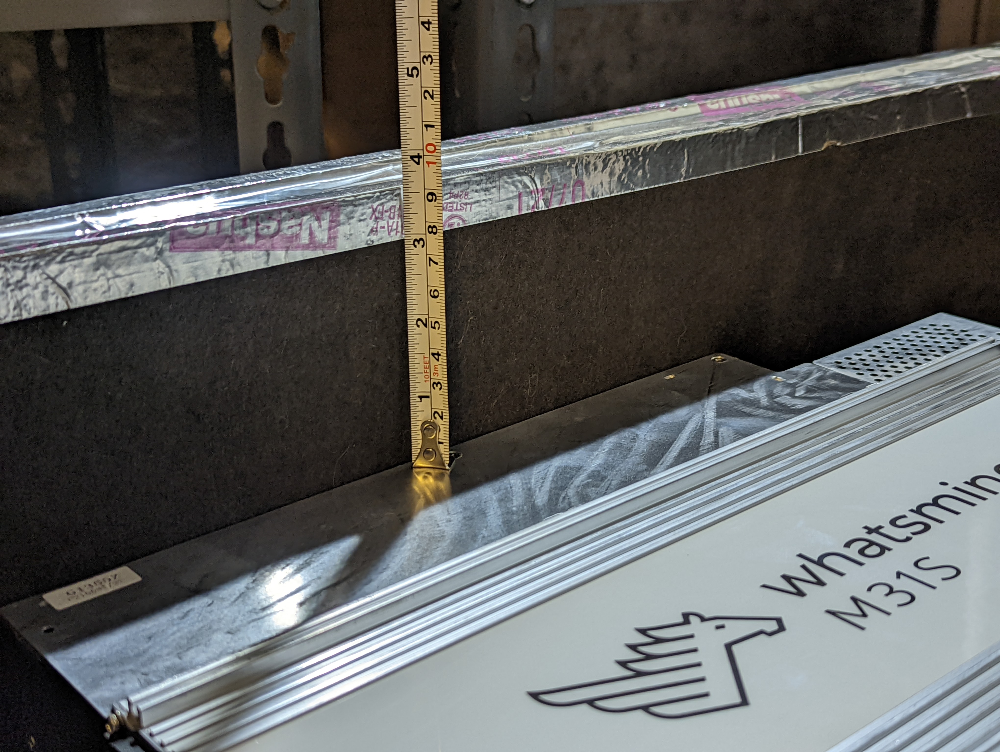
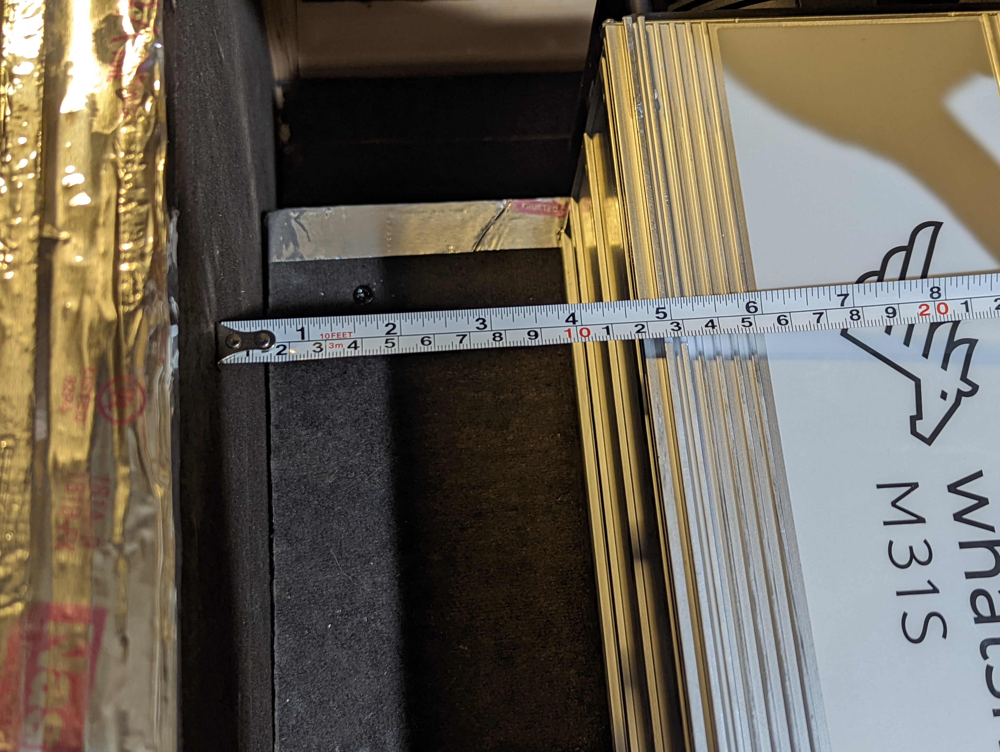

## Testing
Using an S19j Pro as the test subject, noise level readings were measure with the ASIC running in open air at ~78dB. 

The stats on the dashboard at this time indicated normal operation with hash rate at ~113Th, outlet temperatures ranging from  67° C - 72° C, and fan speeds holding steady at 5,040 RPM. 

Depending on which ASIC you have, they will fit a little differently in the enclosure, but both the Antminer S19 and the Whatsminer M30S series miners will fit. Both ASICs will need to rest on their side and either flush up against one of the interior walls to reduce the amount of material needed for the pressure barrier, or in the center if you want the miner to be symmetrical. The pressure barrier is important to separate the cool intake side of the enclosure and the hot exhaust side of the enclosure. 

From the top edge of the S19 to the top edge of the enclosure, there was a ~1-1/2" gap. The layered material on the underside of the top measured 1". This required 1/2" of air space to be blocked off in order to maintain a good pressure seal between the hot and cold sides. 

From the side edge of the S19 to the interior edge of the enclosure, there was a ~2" gap. These gaps can be blocked with a variety of materials. Just so long as there is an air tight seal around the ASIC to keep the hot and cold sides separate. 

From the top edge of the Whatsminer to the top edge of the enclosure, there was a ~3-5/8" gap. The layered material on the underside of the top measured 1". This required 2-5/8" of air space to be blocked off in order to maintain a good pressure seal between the hot and cold sides. 

From the side edge of the Whatsminer to the interior edge of the enclosure, there was a ~4-5/8" gap. These gaps can be blocked with a variety of materials. Just so long as there is an air tight seal around the ASIC to keep the hot and cold sides separate. 

After starting the S19 back up and letting the system stabilize, another noise reading was measured with the SPL meter, this time there was a ~20dB attenuation. 

After an hour of run time, the stats on the dashboard at this time indicated normal operation with hash rate at ~110Th, outlet temperatures ranging from  66° C - 67° C, and fan speeds holding steady at 4,920 - 5,040 RPM. 

Here is a video of the S19 running inside the enclosure:

