# UpstreamData-DIY-BlackBox
DIY Guide for an indoor BlackBox ASIC enclosure.

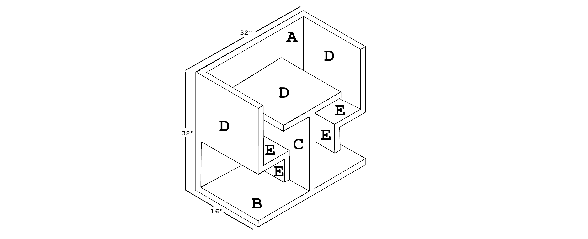

This guide will show you how to use less than $150 in commonly available materials to build an ASIC enclosure that can attenuate the noise by 20dB. The original idea for this enclosure design was put in the public domain by [Steve Barbour](https://twitter.com/SGBarbour) of [Upstream Data](https://blog.upstreamdata.ca/) around the end of August 2021 in [this tweet thread](https://twitter.com/SGBarbour/status/1430332234951651330?s=20&t=5mmKoL9AzcqsUX-FoMzCGw). 

The intent of the BlackBox enclosure is to allow the user to run their mining ASIC hardware outdoors where the heat and noise could more easily be controlled or dissipated. Excessive heat and noise are common problems users experience when mining bitcoin in the home or working space.

The enclosure is designed with the ASIC raised on a platform above the air intake/discharge with a symmetrical 'S' shaped air flow path connecting each. This flow path allows snow, rain or dirt to fall out before it enters the ASIC, potentially causing damage. The ASIC itself is the prime mover of the heated air with an added barrier creating a pressure seal between the low pressure intake side and the high pressure discharge. The "tortuous" shape of the air flow path also helps deaden the sound waves as it reflects and is absorbed within the enclosure, reducing overall noise. The supporting column holding up the ASIC separates the 'hot'/'cold' aisles and includes an air recirculating valve (air register) which gives the user the ability to recirculate heat when needed, for example in cold or humid climates. Finally, the design also allows for power scalability by elongating the dimension of the box perpendicular to the air flow path, enabling room for more mining ASICs up to 12 in a row in an 8' long enclosure.

The commercial version manufactured by Upstream Data Inc., [which can be found here](https://shop.upstreamdata.ca/product/ohmm-black-box/), is made from weather and fire resistant materials so the user can run it safely outdoors or in their home.  The DIY version embodied in this official guide is meant for indoor mining using low cost, readily available materials although weatherproofing is possible if sufficient seals and filters are added.  

Here is a time-lapse video of the whole build process for you to come back to and reference as you read through this guide. 

## Step 1: Materials
The first step is to gather the materials you want. These are the materials shown in this guide, but feel free to experiment with other materials. 

Everything used for materials on this project was purchased from Home Depot for just under $150.00 USD at the time of writing, January 2022. There are a variety of materials to use for lining the inside of the enclosure. You do not need to use the materials listed here. The reasoning for these specific materials will be discussed below but feel free to experiment and find what works best for you. 

- 1 X OSB sheet, 7/16" x 48" x 96" [example](https://www.homedepot.com/p/LP-OSB-7-16-in-Sheathing-Panel-Application-as-4-ft-x-8-ft-386081/202106230)
- 1 X asphalt sheet, 1/2" x 48" x 96" [example](https://www.homedepot.com/p/1-2-in-x-4-ft-x-8-ft-Southern-Pine-Asphalt-Impregnated-Board-A11230848096/206086210)
- 3 X Dense Shield title backer, 1/2" x 32" x 60" [example](https://www.homedepot.com/p/DensShield-Gypsum-Backer-Board-1-2-in-x-2-7-ft-x-5-ft-Tile-Backer-008590/100322694)
- 2 X Lumber, 2" x 3" x 96" [example](https://www.homedepot.com/p/2-in-x-3-in-x-96-in-Select-Kiln-Dried-Whitewood-Stud-845000/100038668)
- 2 X Liquid Nails adhesive [example](https://www.homedepot.com/p/Liquid-Nails-10-oz-Heavy-Duty-Construction-Adhesive-LN-903/100176209)
- 1 X Roll of foil duct tape [example](https://www.homedepot.com/p/Nashua-Tape-2-5-in-x-60-yd-324A-Premium-Foil-HVAC-UL-Listed-Duct-Tape-1542698/100048600)
- 1 X Vent register, 4" x 10" [example](https://www.homedepot.com/p/Everbilt-4-in-x-10-in-2-Way-Steel-Floor-Register-in-White-E150MW-04X10/300539127)
- 1 X Box of long screws [example](https://www.homedepot.com/p/Grip-Rite-9-x-3-in-Philips-Bugle-Head-Coarse-Thread-Sharp-Point-Polymer-Coated-Exterior-Screw-1-lb-Pack-PTN3S1/100115639)
- 1 X Box of short screws [example](https://www.homedepot.com/p/Grip-Rite-8-x-1-1-4-in-Star-Drive-Bugle-Head-Construction-Screw-1-lb-Pack-114GCS1/204982239)

The OSB was used because it is easy to work with, relatively cheap, and widely available. OSB is not fire rated however, consider using a different material if this is a concern.

The asphalt board was used because it is good at noise absorption. Be aware though that asphalt board emits a distinct odor when it heats up and this may not be pleasant or suitable for your living area, more suitable for a garage, shed or basement. 

The Dense Shield backer board was used because it is a heavy dense material good for blocking noise.

Consider using different materials if you have ideas you want to try out.

## Step 2: Tools
Once you have the materials, you will need some tools to work with those materials. Here is a list of tools used in this guide:

- Chop saw
- Skill saw
- Table saw
- Air compressor
- Impact drill
- Tape measure
- Level
- Caulking gun
- Grinder
- Clamps

Consider getting at least these tools before starting your project.

## Step 3: Preparation

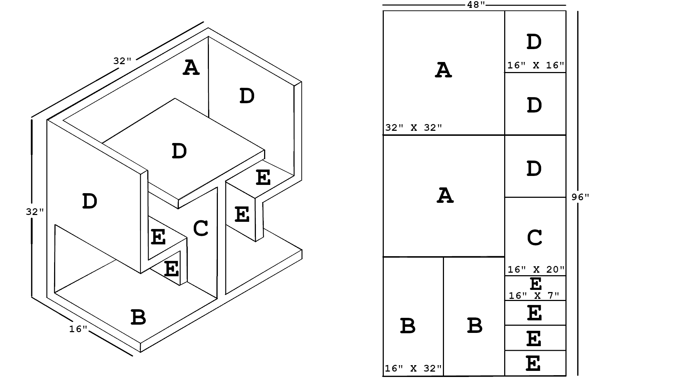

This is the drawing that was used to prepare the OSB, asphalt board, and Dense Shield. All layers of these three materials in the guide were glued together with the Liquid Nails as the individual pieces were assembled. All pieces were first cut to these rough dimensions. Depending on the materials you decide to use for lining your enclosure, the final dimensions may vary. Starting with these rough dimensions is recommended, then during the assembly process you will be able to cut down pieces to be the correct size accordingly. 

For example, the final exterior dimensions of the enclosure are 32" H x 33" L x 16" W. However, the dimensions of the interior pieces were only 13-1/2" wide because of the space taken up by the lining materials. The dimensions of the pieces you use on the interior of your enclosure will be determined by the thickness of the lining materials you have selected. 

The OSB, asphalt board, and Dense Shield were all cut to the sizes of the pieces in the drawing above. 

## Step 4: Assemble the frame
Once all the pieces are cut to the rough sizes, start with the bottom piece of OSB, 16" x 32". Cut 4 pieces of lumber at 31-1/2" to make the corners. Then drive a screw into each piece of lumber from the OSB side to fasten the corners to the board, aligning them with the corners. Then you can notch out the corners of the piece of Dense Shield that will be placed on the bottom of the frame, on top of the OSB. The Dense Shield is glued to the OSB. You can also fasten the two 16" x 16" end pieces (D) to either end of the frame, as well as attach one of the 32" x 32" sides. 

Then you can notch out the corners of the piece of asphalt board that will be placed on the bottom of the frame, on top of and glued to the Dense Shield. A screw was used in each corner of layered pieces to help keep them together.

Then you can now take a 32" x 32" (A) piece of the Dense Shield and asphalt board and fit them to the interior-side of the frame by cutting off the material that is taken up by the corner pieces. Then you can trim the excess material off the top of the Dense Shield and asphalt board to make them even with the OSB.

So far, you have something like this, where you have an OSB frame with layered Dense Shield and asphalt board on the bottom and one of the sides.

## Step 5: Add the wings
Next, measure and cut a piece of lumber to fit in between the corner posts on either end. In this example, these pieces were 13" in length. Align these pieces so the bottom of the lumber is even with the bottom of the OSB. Then you can use a long screw to fasten it into place from the covered 32" x 32" side as well as take a short screw and fasten it from the 16" x 16" OSB end piece, the other side of the piece of lumber will be fastened once the final piece of OSB is in place on the open side. 

Next, take two of the 7" x 16" (E) pieces and cut them to the final interior dimension width. In this case it was 13-1/2" after the 1/2" of OSB from the first side is subtracted, as well as subtracting the layers of Dense Shield and asphalt board from both sides. Keep in mind, these dimensions are going to change based on the materials you select, so make sure you measure twice and cut once. You will also need to notch out the corners of the (E) pieces to fit around the corner posts. Fasten the (E) pieces to the bottom of the piece of lumber you attached in the last step. The edge of the (E) piece should be even with the edge of the (D) piece.

Next, cut two more pieces of lumber to the same length as the final interior dimension, 13-1/2" in this case. Then fasten these pieces of lumber to the bottom of the (E) pieces. The edge of the lumber should be even with the edge of the (E) piece. 

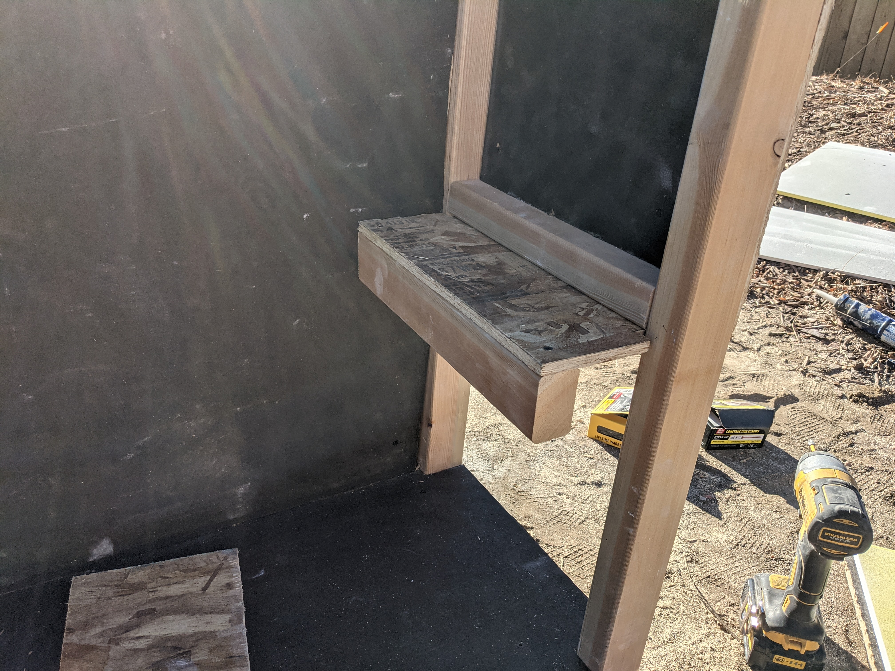

Next, take the other two (E) pieces and attach them to the face of the piece of lumber you fastened in the last step.  

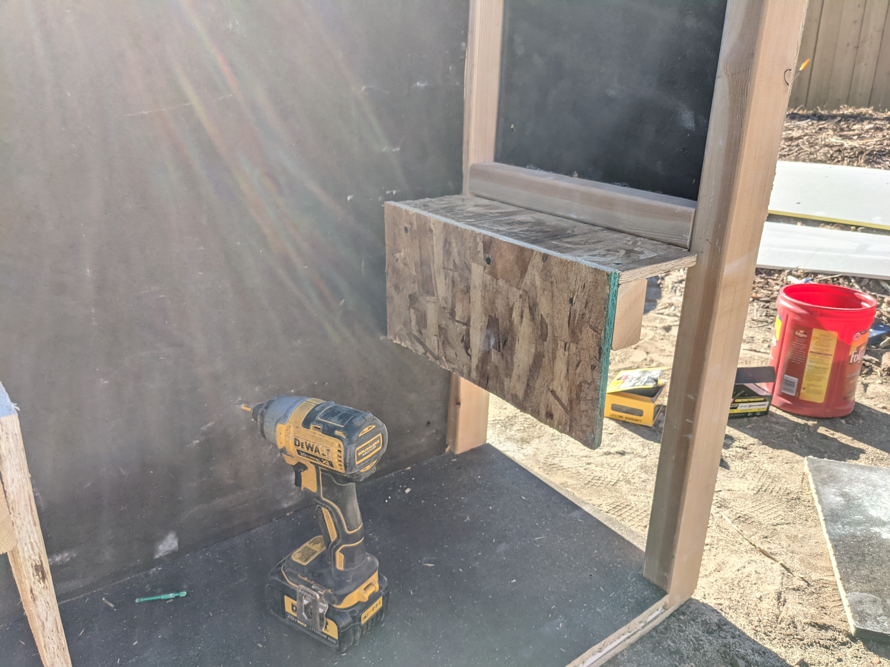

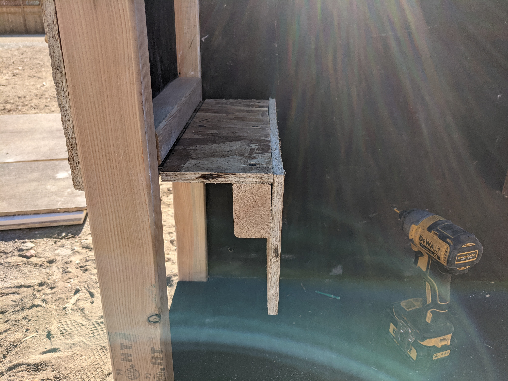

Next, cut the pieces of Dense shield and asphalt board to fit the face edge, adding glue in between each layer. 

Next, cut the remaining (E) pieces of the Dense Shield and asphalt board to fit over the top of all three layers on the face edge.

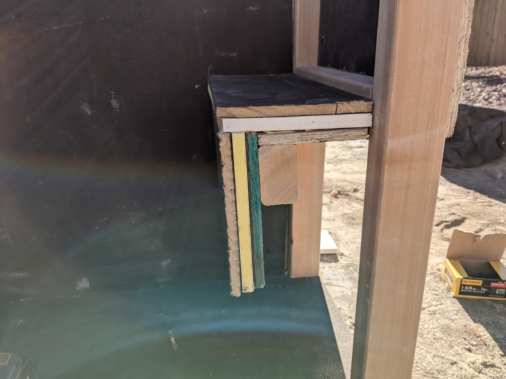

You can use the foil tape to help keep the corners clean. This should also help keep the edges from deteriorating over time. 

## Step 6: Build the "T"
For the "T" piece that goes in the center, first cut the width appropriately for the finished interior dimensions. Then you can cut two more pieces of lumber and attach them to the top and bottom of the (C) piece of OSB, aligning the edges. Then you can place the vent register on that, trace it, then cut it out so the register fits through. For the "T", a piece of Dense Shield and asphalt board were used on both sides of the OSB, so in total, the "T" had 5 layers.

Then align the (C) piece of Dense Shield with the OSB and trace out for the vent through the hole you just cut out. 

Repeat that same process for the asphalt board. 

Then the (D) pieces of OSB, Dense Shield, and asphalt board were fastened to the top of the "T", using the lumber as the anchor point. The (D) piece of OSB should be fastened perpendicular and center with the (C) piece of OSB. Once attached, the (D) pieces were glued to the top and some smaller pieces of Dense Shield were added to the under-side of the (D) piece. The vent register cutout was taped over with the foil tape to help keep the edges clean and to prevent them from deteriorating over time. 

Once
 the "T" is all assembled, align it with the center of the enclosure, in this example, that was 16" on center for the outer edge of the corner posts.

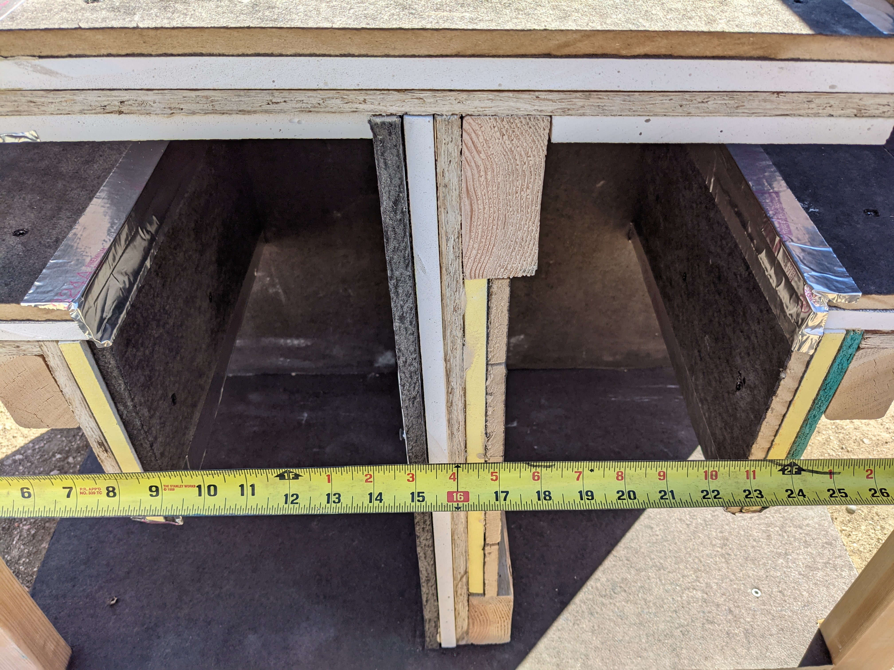

The "T" then can be fastened to the enclosure from the back (closed) side, driving a long screw through the OSB, Dense Shield, & asphalt board and into the lumber material that was fastened to the top and bottom of the (C) piece. Once the other (A) piece is set into place, long screws will be used to drive through the layers and into the ends of the six pieces of lumber as indicated here with red dots. 

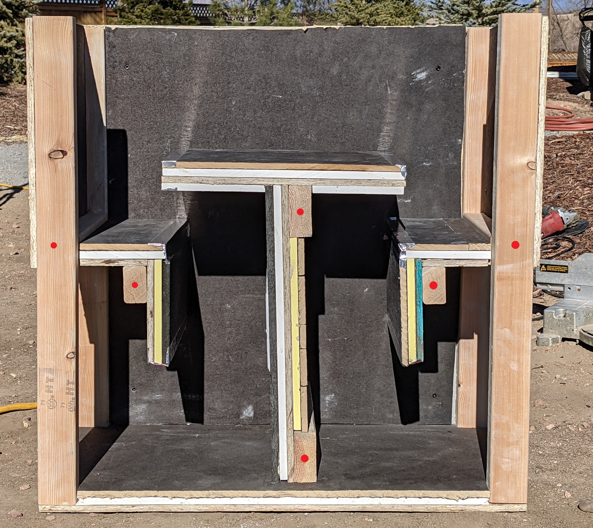

## Step 7: Finish the side and top
Now the remaining side piece (A) can be fit into place by removing the width of the two corner pieces of lumber. So in this example, the original pieces of asphalt board and Dense Shield were 32" wide, then 5" was cut off the sides to account for the two corner posts. The enclosure was layered on its side and the asphalt board and Dense Shield was put in place, then the 32" x 32" (A) piece of OSB was layered on top of them and fastened into place using the long screws to anchor into the six pieces of lumber as indicated above. Liquid Nails was used in between each layer.

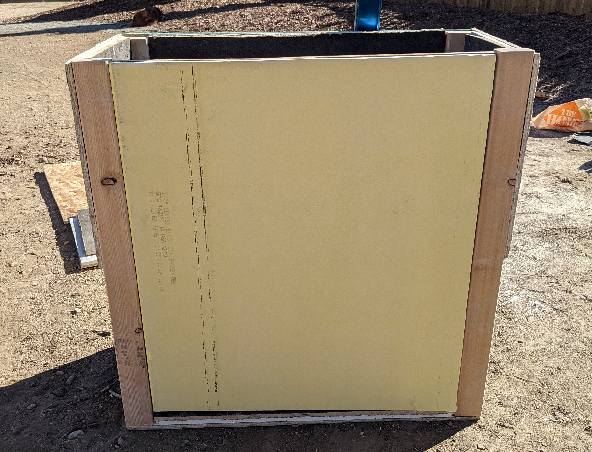

Then foil tape was used just to keep all the edges clean and to prevent splintering/deterioration. 

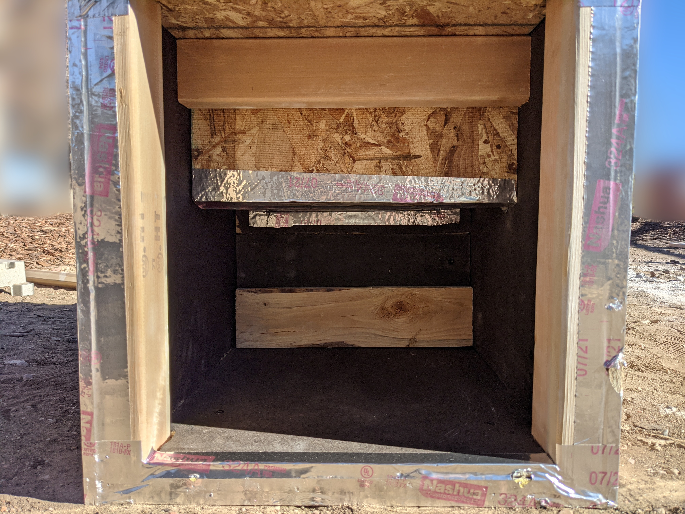

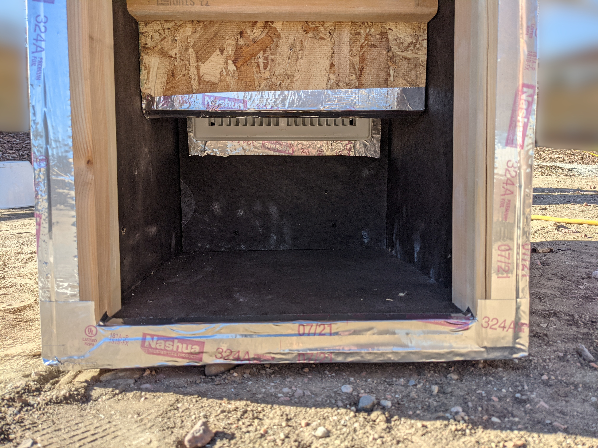

Then for the top, the idea here was that the OSB would lie flush over the top edges of the enclosure and a layer of Dense Shield and asphalt board would be attached to the under-side of the top so that they fit down inside the enclosure. The remaining 32" x 16" (B) pieces had to be cut to fit the final interior length and width and notched out for the corner posts. 

All the layers were glued together with Liquid Nails and screws were also used to help keep the layers attached to the underside of the top OSB piece. Two short pieces of chain were also used as make-shift handles and fastened to the top so that it could be removed with ease. All the edges were covered with foil tape to help keep them from splintering/deteriorating. 

## Testing
Using an S19j Pro as the test subject, noise level readings were measure with the ASIC running in open air at ~78dB. 

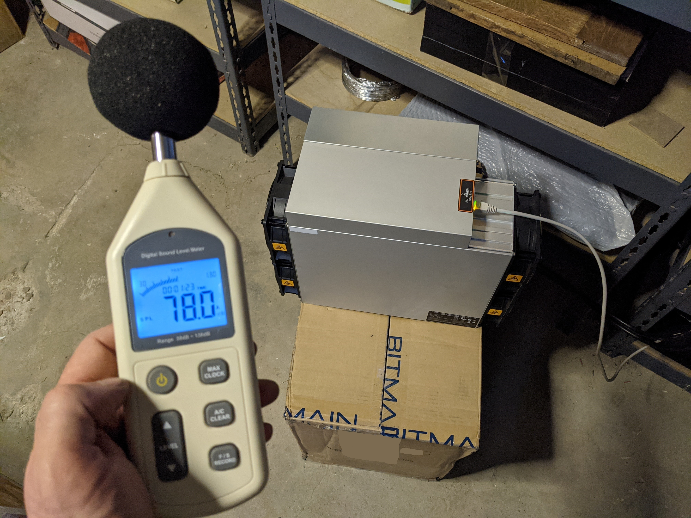

The stats on the dashboard at this time indicated normal operation with hash rate at ~113Th, outlet temperatures ranging from  67° C - 72° C, and fan speeds holding steady at 5,040 RPM. 

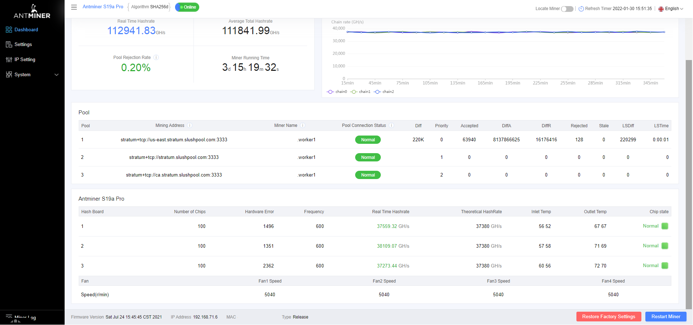

Depending on which ASIC you have, they will fit a little differently in the enclosure, but both the Antminer S19 and the Whatsminer M30S series miners will fit. Bother ASICs will need to rest on their side and either flush up against one of the interior walls to reduce the amount of material needed for the pressure barrier, or in the center if you want the miner to be symetrical. The pressure barrier is important to separate the cool intake side of the enclosure and the hot exhaust side of the enclosure. 

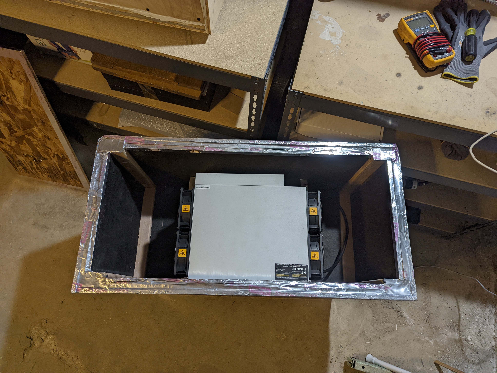

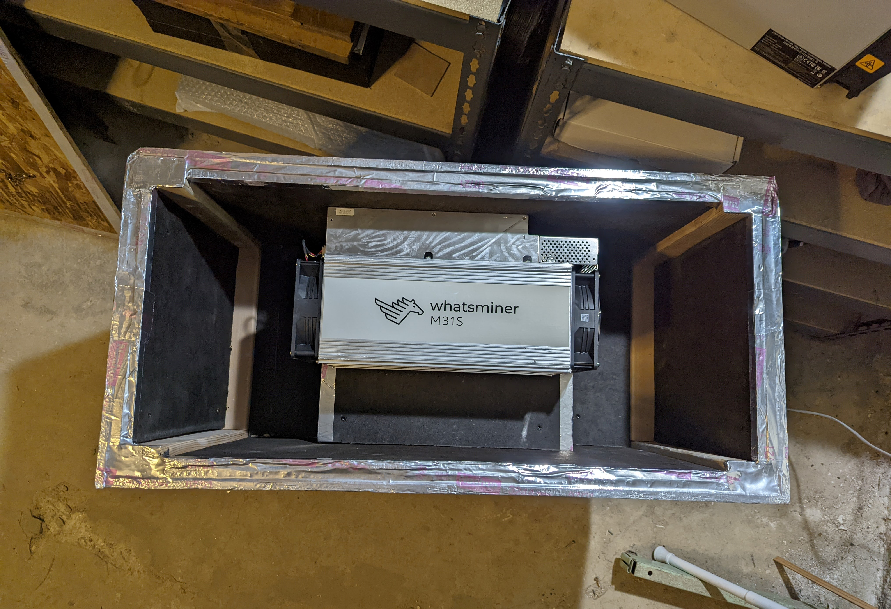

From the top edge of the S19 to the top edge of the enclosure, there was a ~1-1/2" gap. The layered material on the underside of the top measured 1". This required 1/2" of air space to be blocked off in order to maintain a good pressure seal between the hot and cold sides. 

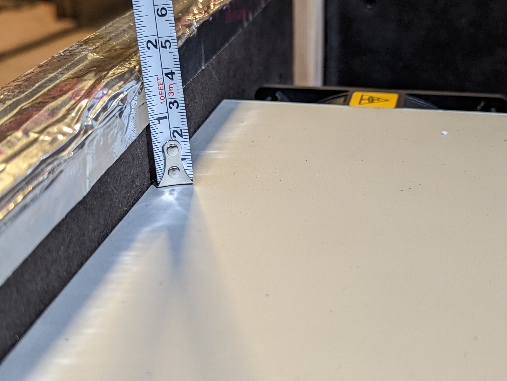

From the side edge of the S19 to the interior edge of the enclosure, there was a ~2" gap. These gaps can be blocked with a variety of materials. Just so long as there is an air tight seal around the ASIC to keep the hot and cold sides separate. 

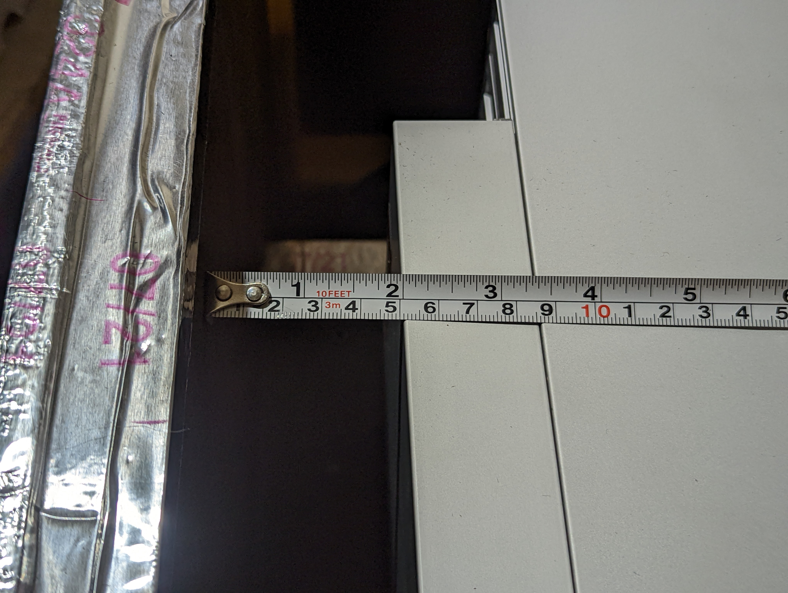

From the top edge of the Whatsminer to the top edge of the enclosure, there was a ~3-5/8" gap. The layered material on the underside of the top measured 1". This required 2-5/8" of air space to be blocked off in order to maintain a good pressure seal between the hot and cold sides. 

From the side edge of the Whatsminer to the interior edge of the enclosure, there was a ~4-5/8" gap. These gaps can be blocked with a variety of materials. Just so long as there is an air tight seal around the ASIC to keep the hot and cold sides separate. 

After starting the S19 back up and letting the system stabilize, another noise reading was measured with the SPL meter, this time there was a ~20dB attenuation. 

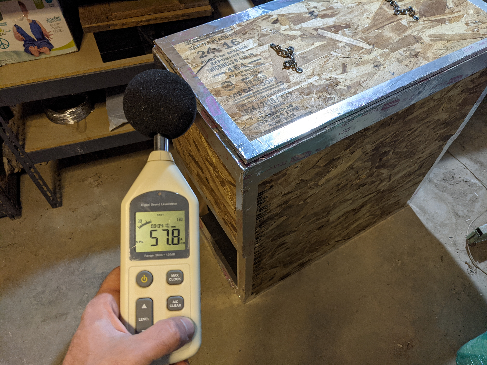

After and hour of run time, the stats on the dashboard at this time indicated normal operation with hash rate at ~110Th, outlet temperatures ranging from  66° C - 67° C, and fan speeds holding steady at 4,920 - 5,040 RPM. 

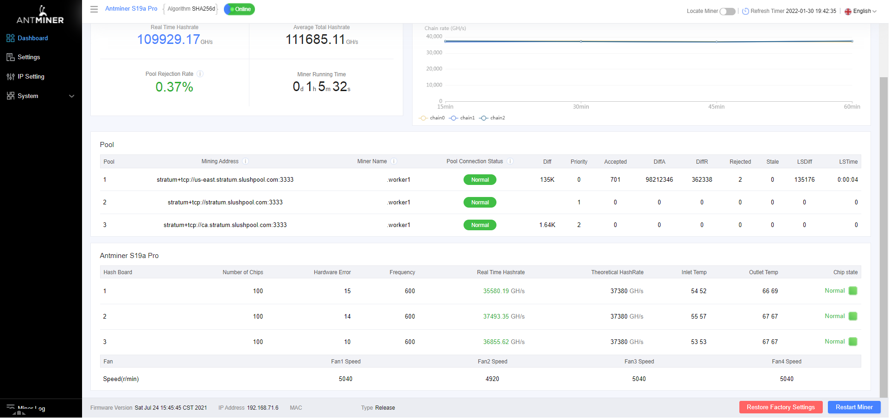

Here is a video of the S19 running inside the enclosure:

## Conclusion
This guide should have given you the basic explanations needed to see how you can build an indoor rated enclosure that will attenuate the noise of the ASIC by as much as 20dB. Different materials can be experimented with to try and achieve even more noise attenuation. For less than $150 and some elbow grease, this is a great solution for DIY enthusiasts who want to build their own enclosure based on the BlackBox design from Upstream Data. 

There are many great resources from DIY enthusiasts that have been building off of the original BlackBox idea:

The [guide](https://bikesandbitcoin.substack.com/p/ep015-mining-bitcoin-in-an-apartment) from [@BikesandBitcoin](https://twitter.com/BikesandBitcoin)

The [guide](https://yooperhodl.substack.com/p/yooper-crate) from [@yooperHodl](https://twitter.com/yooperHodl)

The [guide](https://www.reddit.com/r/BitcoinMining/comments/qqsbta/hobby_mining_journey_in_vietnam/) from [@Quierespowpow](https://twitter.com/Quierespowpow)
